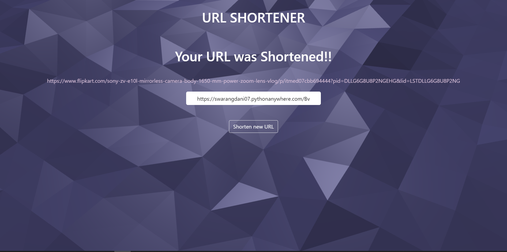

# URL-Shortener-Service
A django based URL Shortening Service which takes a long URL and converts it into a short url
```python
https://swarangdani07.pythonanywhere.com/
```

## Features:

*   Given a Long URL , generates Unique Short URL
*   Given a short URL , redirects to original URL
*   Base62 encoding  (a-zA-Z0-9)  for unique short code
*   Fully Responsive and accessible through Rest-API

## Shortening Algorithm:

```python
def b62Encode(num):
    s = string.ascii_uppercase+string.ascii_lowercase+string.digits
    if num == 0:
        return '0'
    mycode = ""
    while num > 0:
        mycode = s[int(num%62)] + mycode
        num = num//62
    return mycode
```

## How to run locally:

*   Download zip file or clone this repository
*   Create a virtual environment:
*   Install the dependencies using command:  `pip install -r requirements.txt`
*   Run the server using command:  `python manage.py runserver`
*   Visit `127.0.0.1:8000` on your web browser

## API Endpoints:

*   For Shortening URL, send POST request to `https://domain_name/api/create/`
*   For Accessing Shortened URL, send GET request to `https://domain_name/<Base62code>`


      


